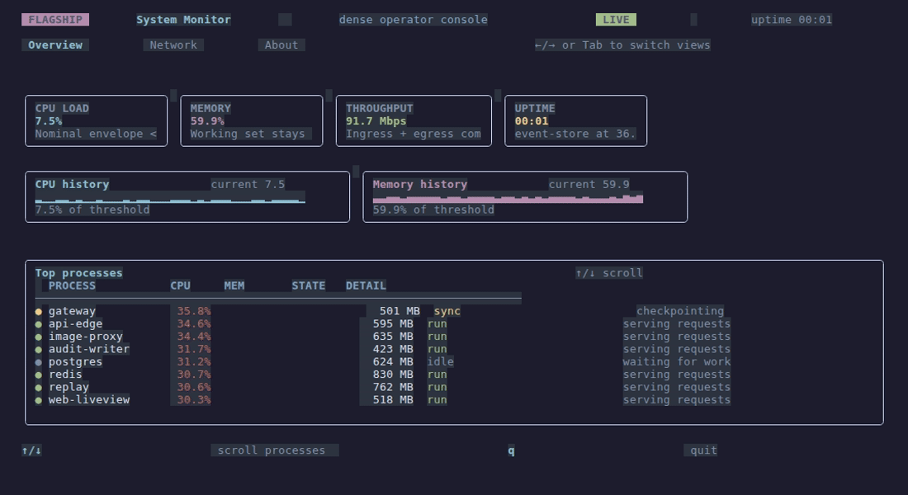
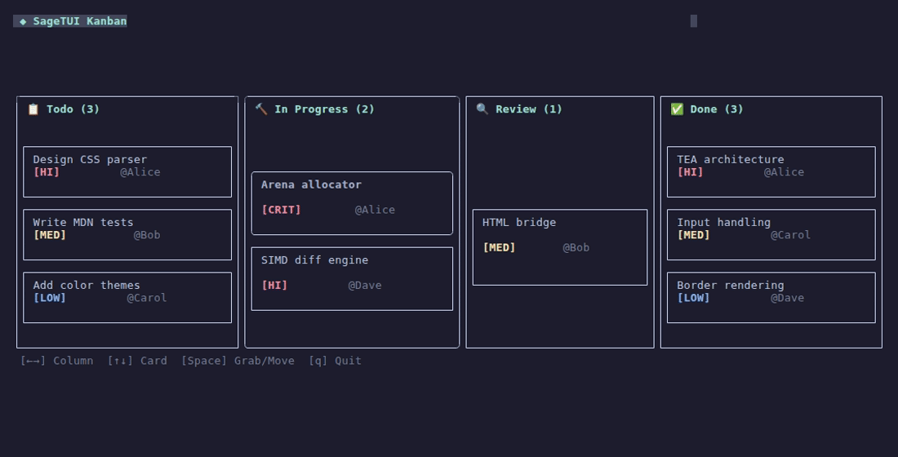
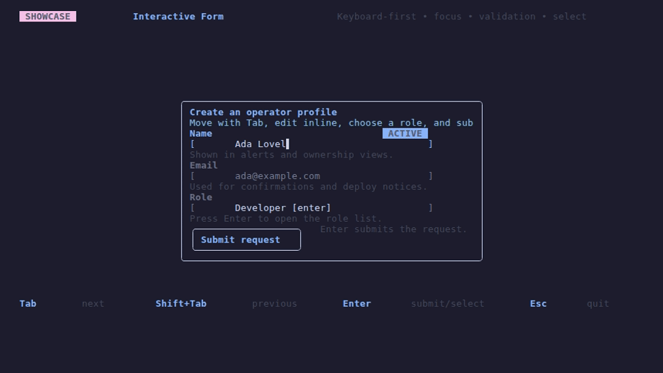
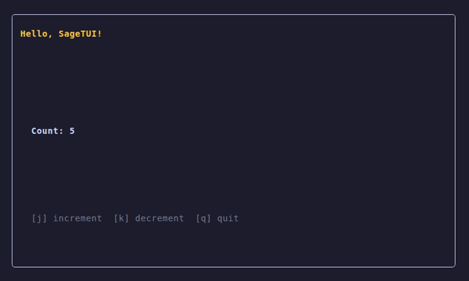

# SageTUI

**Build beautiful terminal UIs in F# with zero ceremony.**

Elm Architecture • SIMD rendering • 1,561 tests • Core package has zero external dependencies

## See It In Action

<table>
<tr>
<td align="center" width="50%">

**System Monitor** — tabs, live metrics, scrolling process list



</td>
<td align="center" width="50%">

**Kanban Board** — keyboard card navigation and multi-column moves



</td>
</tr>
<tr>
<td align="center" width="50%">

**Interactive Form** — text input, dropdown selection, validation



</td>
<td align="center" width="50%">

**Hello World** — the simplest possible TEA app



</td>
</tr>
</table>

> **Run any sample yourself:** `dotnet run --project samples/09-SystemMonitor`


## Install

### Core library

```bash
dotnet add package SageTUI
```

### Project template

```bash
dotnet new install SageTUI.Templates
dotnet new sagetui -n MyApp
cd MyApp && dotnet run
```

### Optional HTML bridge

`SageTUI.Html` is a separate package/project for HTML parsing and rendering. It is not part of the core `SageTUI` package.

## 60-Second Quickstart

If you want the fastest path, use the template:

```bash
dotnet new install SageTUI.Templates
dotnet new sagetui -n MyApp
cd MyApp
dotnet run
```

If you want to start from an empty F# console app, paste this complete `Program.fs`:

```fsharp
open SageTUI

type Msg =
  | Increment
  | Decrement
  | Quit

let init () = 0, Cmd.none

let update msg count =
  match msg with
  | Increment -> count + 1, Cmd.none
  | Decrement -> max 0 (count - 1), Cmd.none
  | Quit -> count, Cmd.quit

let view count =
  El.column [
    El.text "Hello, SageTUI!"
      |> El.bold
      |> El.fg (Color.Rgb(255uy, 200uy, 50uy))
    El.text ""
    El.text (sprintf "Count: %d" count) |> El.bold
    El.text ""
    El.text "[j] increment  [k] decrement  [q] quit" |> El.dim
  ]
  |> El.padAll 1
  |> El.bordered Rounded

let keyBindings =
  Keys.bind [
    Key.Char 'j', Increment
    Key.Char 'k', Decrement
    Key.Char 'q', Quit
    Key.Escape, Quit
  ]

let program : Program<int, Msg> =
  { Init = init
    Update = update
    View = view
    Subscribe = fun _ -> [ keyBindings ] }

[<EntryPoint>]
let main _ = App.run program; 0
```

Press `q` or `Esc` to quit.

## Smallest Possible Static View

For one-off screens and demos:

```fsharp
open SageTUI

App.display (fun () ->
  El.text "Hello from SageTUI!"
  |> El.bold
  |> El.fg (Color.Named(Cyan, Bright))
  |> El.bordered Rounded
  |> El.padAll 1)
```

`App.display` is the smallest API surface; `App.run` is the full Elm Architecture entry point.

## Interactive App (Elm Architecture)

```fsharp
open SageTUI

type Msg = Increment | Quit

let init () = 0, Cmd.none

let update msg count =
  match msg with
  | Increment -> count + 1, Cmd.none
  | Quit -> count, Cmd.quit

let view count =
  El.column [
    El.text (sprintf "Count: %d" count) |> El.bold
    El.text "[j] increment  [q] quit" |> El.dim
  ] |> El.padAll 1 |> El.bordered Rounded

let keyBindings =
  Keys.bind [
    Key.Char 'j', Increment
    Key.Char 'q', Quit
    Key.Escape, Quit
  ]

let program : Program<int, Msg> =
  { Init = init
    Update = update
    View = view
    Subscribe = fun _ -> [ keyBindings ] }

[<EntryPoint>]
let main _ = App.run program; 0
```

`App.run` auto-detects your terminal capabilities and handles setup, rendering, and cleanup.

## Features

| Category | What You Get |
|----------|-------------|
| **Architecture** | Elm Architecture (init/update/view/subscribe), pure state management |
| **Layout** | Row, Column, Fill, Percentage, Min/Max, padding, borders, alignment, gap, flex-shrink |
| **Rendering** | Arena-allocated zero-GC frame loop, SIMD-accelerated diff, 24-bit TrueColor |
| **Widgets** | TextInput, Select, Table, Tabs, Modal, TreeView, ProgressBar, Checkbox, Toggle, RadioGroup, SpinnerWidget, Toast, Form |
| **Scrolling** | ScrollState, scroll indicators, mouse wheel, ScrollableList, keyboard navigation |
| **Canvas** | HalfBlock (▀/▄) and Braille (⠿) pixel modes |
| **Transitions** | Runtime support for Fade, Wipe, Dissolve, and ColorMorph, with additional transition shapes modeled in the API |
| **Themes** | 5 built-in themes (dark, light, nord, dracula, catppuccin) |
| **HTML Bridge** | Optional `SageTUI.Html` package for parsing HTML fragments into Element trees |
| **Mouse** | Click subscriptions, hit-testing with Z-order, focus cycling |
| **Safety** | Restores the terminal on unhandled managed exceptions |

## Why SageTUI

- **F#-native TEA** — immutable model, explicit messages, pure view functions
- **Terminal-native layout** — rows, columns, fill, percentages, borders, alignment, gap
- **Fast rendering path** — packed cells, arena lowering, and diffing that avoids repainting unchanged output
- **Testable by design** — integration and snapshot tests can render real programs without a live terminal
- **Small mental model** — toolkit, not framework ceremony

## Layout Engine

Terminal-native flexbox with CSS vocabulary:

```fsharp
// Rows and columns
El.row [ El.text "Left" |> El.fill; El.text "Right" |> El.width 20 ]

// Box model
El.text "Content" |> El.padAll 1 |> El.bordered Rounded

// Alignment
El.text "Centered" |> El.center

// Gap between children
El.column [ El.text "A"; El.text "B"; El.text "C" ] |> El.gap 1

// Percentage sizing
El.row [
  El.text "Sidebar" |> El.percentage 30
  El.text "Main" |> El.fill
]
```

## Widgets

```fsharp
TextInput.view focused model.Input
ProgressBar.view { ProgressBar.defaults with Percent = 0.75; Width = 40 }
Tabs.view {
  Items = ["Home"; "Settings"; "Help"]
  ActiveIndex = activeTab
  ToString = id
  ActiveColor = Some (Color.Named(Cyan, Bright))
  InactiveColor = None
}
Table.view columns rows (Some selectedRow)
Modal.view { Modal.defaults with BorderStyle = Rounded; MaxWidth = Some 40 } content
TreeView.view id focused nodes treeState
Form.view fields focusedKey model
```

These are low-level building blocks. Most real apps compose them inside `view` functions rather than relying on a heavyweight retained widget tree.

## Themes

```fsharp
let themed = Theme.dark  // or: light, nord, dracula, catppuccin
Theme.heading themed "Styled heading"
Theme.panel themed "My Panel" (El.column [...])
```

## .NET Interop

Call any .NET library from your update function:

```fsharp
let update msg model =
  match msg with
  | FetchData ->
    model, Cmd.ofTask
      (fun () -> httpClient.GetStringAsync("https://api.example.com/data"))
      (fun result -> DataReceived result)
  | DataReceived data -> { model with Data = data }, Cmd.none
```

## HTML Rendering

`SageTUI.Html` is an optional companion package/project for rendering HTML into SageTUI elements.

```fsharp
open SageTUI.Html

let html = """<div>
  <h1 style="color: cyan">Dashboard</h1>
  <table>
    <tr><th>Service</th><th>Status</th></tr>
    <tr><td>API</td><td style="color: green">● Online</td></tr>
  </table>
</div>"""

let element = HtmlString.parseFragment html
```

## Performance

Benchmarked with [BenchmarkDotNet](https://github.com/dotnet/BenchmarkDotNet) on .NET 10.0, i7-11800H:

| Benchmark | Mean | Allocated |
|-----------|------|-----------|
| Buffer.diff identical (80×24) | **637 ns** | 32 B |
| Buffer.diff 10% changed (80×24) | **3.3 μs** | 2.2 KB |
| Render dashboard tree (80×24) | **19.4 μs** | 6.6 KB |
| Arena render dashboard (80×24) | **31.8 μs** | 310 KB |
| Layout 50-item column | **26.1 μs** | 91 KB |
| Layout nested 3-level (10 rows) | **102 μs** | 143 KB |

The render path is built around packed cells, arena lowering, and JIT-vectorized diffing over unchanged spans.
Some benchmark layers still allocate while constructing trees and layouts; the point is to keep the hot terminal rendering path tight and predictable.

Run benchmarks yourself: `dotnet run -c Release --project SageTUI.Benchmarks`

## Architecture

```
┌─────────────────────────────────────────┐
│          Your Application               │
│  init → update → view → subscribe       │
├─────────────────────────────────────────┤
│            Element Tree                 │
│  Text · Row · Column · Styled · ...     │
├─────────────────────────────────────────┤
│         Arena Rendering (zero-GC)       │
│  Pre-allocated nodes, single pass       │
├─────────────────────────────────────────┤
│       SIMD Diff (hardware accel)        │
│  Only changed cells hit the terminal    │
├─────────────────────────────────────────┤
│         Terminal Backend                │
│  Auto-detect, TrueColor, mouse, raw     │
└─────────────────────────────────────────┘
```

For a deep-dive into the render pipeline, element cases, arena design, and SIMD diff, see [ARCHITECTURE.md](ARCHITECTURE.md).

## Samples

The sample suite is tiered so the strongest experiences lead the front door:

| Tier | Sample | What It Shows |
|------|--------|---------------|
| **Flagship** | **09 SystemMonitor** | Dense operator console: tabs, scrolling, live updates, themes, telemetry |
| **Showcase** | **06 Kanban** | Keyboard-driven board navigation and multi-column state |
| **Showcase** | **08 Sparklines** | Canvas-based telemetry and compact data visualization |
| **Showcase** | **04 InteractiveForm** | Keyboard-first form flow, TextInput, Select, validation |
| **Supporting** | **01 HelloWorld** | Smallest possible TEA app with borders and key bindings |
| **Supporting** | **05 ColorPalette** | Theme semantics, color modes, text styles |
| **Supporting** | **07 Transitions** | Keyed transitions and animated state changes |
| **Supporting** | **02 Dashboard** | Secondary overview sample; useful for layout ideas, not the hero |
| **Experimental** | **03 HtmlRenderer** | HTML→Element bridge and document rendering lab |


If you only run one sample, start here:

```bash
dotnet run --project samples/09-SystemMonitor
```

## Concepts

SageTUI uses the [Elm Architecture](https://guide.elm-lang.org/architecture/) (TEA):

- **Model** — your app's state (an immutable F# type)
- **Msg** — a discriminated union of everything that can happen
- **init** — returns `(model, Cmd)` — your starting state
- **update** — `msg → model → (model, Cmd)` — handle events, return new state
- **view** — `model → Element` — render state as a terminal UI tree
- **subscribe** — `model → Sub list` — declare ongoing subscriptions (keyboard, timers, resize)
- **Cmd** — side effects (async tasks, quit signal). `Cmd.none` means "no side effect"
- **Sub** — ongoing event sources. `Keys.bind` for keyboard, `TimerSub` for polling

## Support & Stability

- **Package version:** 0.1.0
- **Target framework:** .NET 10.0
- **API status:** pre-1.0; expect iterative changes while the surface area settles
- **Core package:** `SageTUI`
- **Template package:** `SageTUI.Templates`
- **Optional companion project:** `SageTUI.Html`
- **Experimental areas:** the HTML bridge and some sample/demo surfaces are still evolving

## Advanced: Custom Backend

For testing or custom terminal implementations:

```fsharp
let profile = Detect.fromEnvironment readEnv getTerminalSize
let backend = Backend.create profile
App.runWithBackend backend program
```

Where `readEnv` is a `string -> string option` function and `getTerminalSize` returns the current terminal size.

## Requirements

- .NET 10.0+
- A terminal with ANSI escape sequence support (all modern terminals)

## License

MIT
